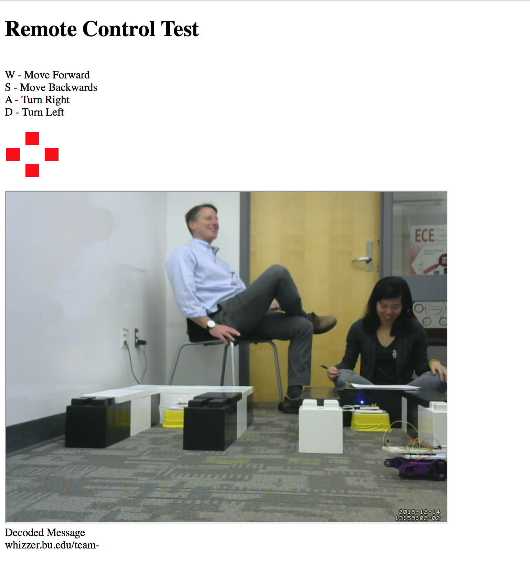
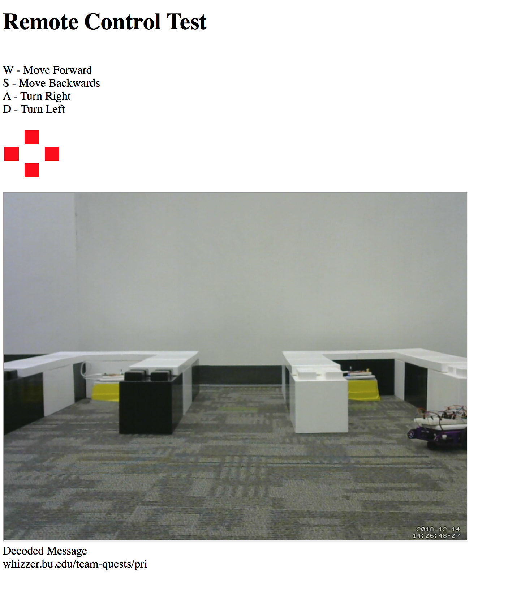
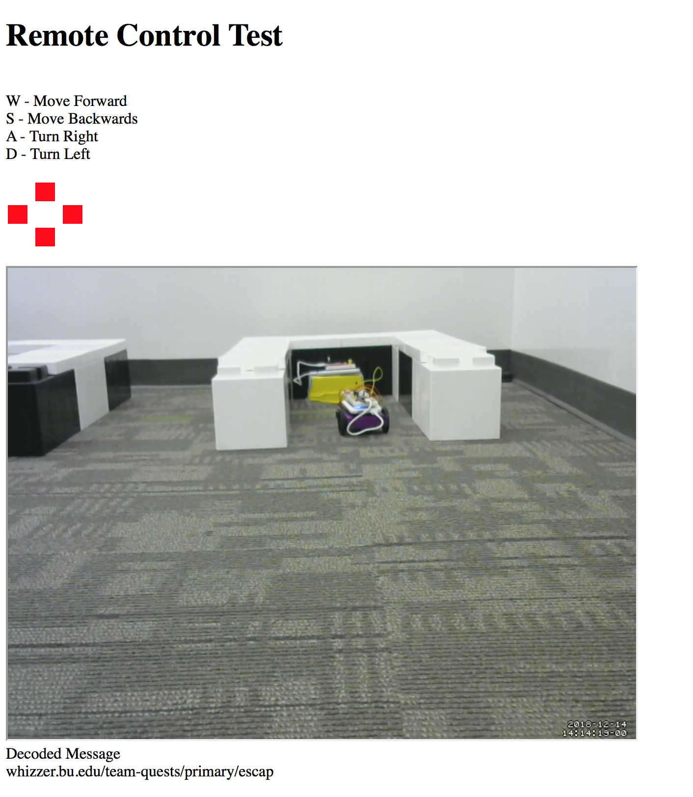

# Escape The Course

Authors: Carlos Callejas, Devin Chen, Mahdiul Chowdhury, 2018-12-14

## Summary

IR Reading: IR/RX is using UART communication to decode the message from beacon. Once the IR verify the start bit, it is storing the ID and fragment in a new variable. And usint HTTPD communication it is sending the data to the client using server. 

HTTPD Server:
There was an http server running on the esp which had post request handlers for the four basic movements (forwards, backwards, left, and right). The motors were run at max duty cycle

Front End:
The user interface was organized so that you could see which buttons you were pressing using a box that turned green for the respective key. The webcam display is below which shows a livestream. Below that is the message being received by the ir receiver.

Backend:
The post commands being sent to the esp were handled by jQuery. We set up key down event to start the motors and key up events to stop the car. The server also polls the message from the robot with a get request every second. It maintains a count to make sure that it only gets the messages in the proper order. Then it concatonates the strings received.

Problems:
There was a large latency between the camera and the client and also the client to the esp due to the congestion in the room. This cause the webcam to freeze and force us to refresh the page and loose progress of the data. A possible solution would be to use something like cookies to verify it is the same user on the client in order to save the data recovered so far.

## Sketches and Photos

Message part 1 

Message part 2

Message part 3

## Modules, Tools, Source Used in Solution

## Supporting Artifacts

ESP-idf examples:
- UART
- MCPWM 
- HTTPD Server

-----

## Reminders

- Please remember to post a link to this report.md file on [Piazza](https://piazza.com/class/jja9ukam6dp48f) including references to each team member.
- Video recording not to exceed 90s
- Each team member appears in video
- Repo is private
